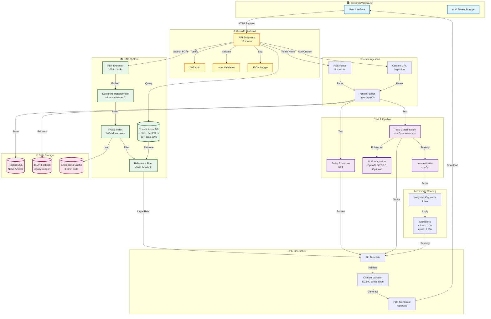
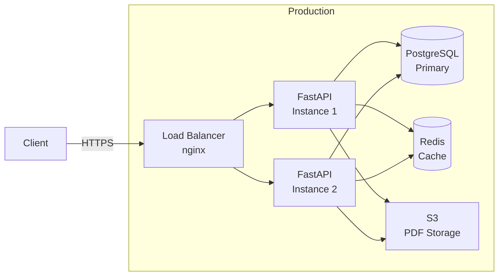

# NyayLens - Architecture Diagram

## System Flow



## Data Flow Detail

### 1. News Ingestion → Storage
```
RSS Feeds (8 sources) 
  → feedparser 
  → newspaper3k (title, text, date)
  → Topic Classification (spaCy NLP + keywords)
  → Entity Extraction (NER: PERSON, ORG, GPE, LAW)
  → Severity Scoring (lemmatized keywords + multipliers)
  → PostgreSQL (NewsArticle table)
```

### 2. Semantic Search Index Build
```
Legal PDFs (RTI, EP Act, BNSS, etc.)
  → pdfminer.six (text extraction)
  → Chunking (400 words, 80 overlap)
  → Constitutional DB (FRs, DPSPs, case laws)
  → sentence-transformers (all-mpnet-base-v2)
  → FAISS IndexFlatIP (cosine similarity)
  → Pickle cache (data/semantic_cache.pkl)
```

### 3. PIL Generation Pipeline
```
User selects article (index)
  → Fetch from PostgreSQL
  → Extract issue (spaCy NER or OpenAI)
  → Retrieve legal sections:
      - ConstDB by topic mapping
      - Semantic search (FAISS, ≥30% similarity)
  → Generate PIL (pil_template.txt)
  → Validate citations (PIL Validator)
  → Export PDF (reportlab)
```

## Technology Stack

| Layer | Technology |
|-------|------------|
| **Frontend** | Vanilla JS, HTML5, CSS3 |
| **Backend** | FastAPI 0.104+, Uvicorn |
| **NLP** | spaCy 3.8, sentence-transformers 5.2 |
| **LLM** | OpenAI GPT-3.5-turbo (optional) |
| **Vector DB** | FAISS-CPU 1.13, chromadb 1.4 |
| **Database** | PostgreSQL (via SQLAlchemy 2.0) |
| **Auth** | JWT (python-jose) |
| **PDF** | reportlab 4.4, pdfminer.six |
| **Testing** | pytest 9.0, pytest-cov 7.0 |

## Key Metrics

- **Legal Documents Indexed**: 1,064 (45 constitutional + 1,019 PDF chunks)
- **Embedding Dimension**: 768 (all-mpnet-base-v2)
- **Relevance Threshold**: 30% cosine similarity
- **Cache Build Time**: 8.6 minutes (one-time)
- **API Endpoints**: 13 routes
- **Test Coverage**: 60+ tests across 9 modules

## Deployment Architecture (Recommended)



---

**Generated**: January 24, 2026  
**Project**: NyayLens - AI-Powered PIL Generator  
**Architecture**: Microservices-ready, RAG-enhanced legal tech system
